# User Interface Design Final Report

Jordan Dehmel, 2025

---

**Creating an Open-Source Text Editor for Static Documents with
Embedded Running Code**

**Abstract:** When preparing documents in math or computer
science courses, PDFs with embedded running code are often
desirable. R-markdown (RMD) is one solution to this, but is
embedded in the large rstudio application. Previous work has
created the JKnit literate programming tool, which is a
lightweight and generic command-line alternative to RMD: The
current project details iteration on a graphical text editor for
JKnit as the final project of CSCI 337 (User Interface Design).

---

## Purpose

This program is aimed at mathematicians and computer scientists
who want to create documents with running code in them (as per
Knuth's idea of "literate programming") without being limited by
bloated or closed-source software. This differs from the use
case of jupyter notebooks, which usually aims to run
interactively: The goal of `jknit` is to compile to static
documentation. The GUI aims to be lightweight and intuitive,
specifically targeting those who do not have CLI experience (EG
math students).

## Requirements

The following things must be true about the final product:

- Interface w/ the CLI
- Avoid bloat
- Be open-source
- Be lightweight and intuitive, targeting those who do not have
    CLI experience
- For the sake of IT, easy to install

## Audience

The users of this software would be mathematicians and computer
scientists who want to create documents with running code in
them.

The "customers" of this software would be universities. These
would be the institutions installing the software, even if no
money is changing hands. For the sake of IT, the GUI should aim
to be dependency-light, easily-managed, and minimally-invasive.

## User Stories (See also UI Test)

The following are possible user stories:

1. "I need to write a report for my math class"
2. "I need to modify and export a JMD file someone sent me"
3. "I need to quickly explain this software to my students"

## First Iteration

The first major iterations were as follows:
1. Paper version
2. Android version
3. First Flutter iteration

### Paper UI

### UI Test

**Stakeholder Stories / Test Cases**

1. "I am an intro to applied math student and I want to create a
    new document to edit, then a new file in the current
    document"
2. "I am an intro to applied math student and I want to find out
    what the 'Dockerfile' option means in the export menu, then
    open an existing document named 'hello.jmd'"
3. "I am a teacher and I want to demonstrate how to create and
    export a document to `markdown` format in my class"

**Measuring Success**

1. Test case 1 will be considered a success if they are able to
    create a new document. It will be a partial success if they
    cannot create a new file. It will be a failure if they are
    not able to create a new document.
2. Test case 2 will be considered a success if they are able to
    navigate to the help menu, then to the 'Docker' menu. Then
    they should be able to navigate back to home and open an
    existing document. It will be a failure if they are unable
    to find help or to escape the help menu and open an existing
    document.
3. Test case 3 will be considered a success if they are able to
    create a new document, then successfully reach the `export`
    screen. It will be a partial success if they stop at this
    point, and a full success if they are able to change the
    default document type and export. It will be a failure if
    they are unable to create or export a document.

**Experimental Design**

- Only the vaguest follow-up questions will be asked after the
    fact so as not to retroactively influence their opinions

The following are both experimental design points and things I
will say to the subject before beginning:

- I will ask them about their experience in CS and math,
    especially in writing reports
- I will have my paper design and simulate the computer
- I will instruct them to narrate their thoughts and actions,
    and I will simulate those actions
- I will give them a task that they will try to complete
- For text blocks and dropdowns that I have not detailed in my
    paper model, I will narrate what will be displayed.

**Choosing A Subject**

Test subject criteria:

- College student
- In a math / CS class (preferably applied math)
- **Not** an experienced CS person

---

**Post-Test Reflection**

1. Task 1 was a partial success: She was able to create a new
    document, but there was no clear way to make a new file in
    that document's folder, and she made a second document
    instead.
2. Task 2 was a success with notes. She found it unclear how to
    find help for a specific keyword, and suggested a search
    function. She was able to navigate back to the home menu
    and open an existing document, although she suggested
    different verbiage for the button doing so.
3. Task 3 was a partial success. She was able to create a new
    document and navigate to the export menu, but was unable to
    proceed without further direction. She found this menu
    overly technical.

The overall impression was that the app was overly technical and
lacking in help. A search bar for keyword help and an "advanced
settings" submenu would likely solve these problems. The menu's
"edit" button should also say something more like "open", and
the help menu should be more intuitive.

### First Flutter Iteration

The first Flutter iteration was a proof-of-concept. The goal was
not so much to make a *pretty* app, but to make a *functional*
app. Accordingly, it is sparse and bland but functional.

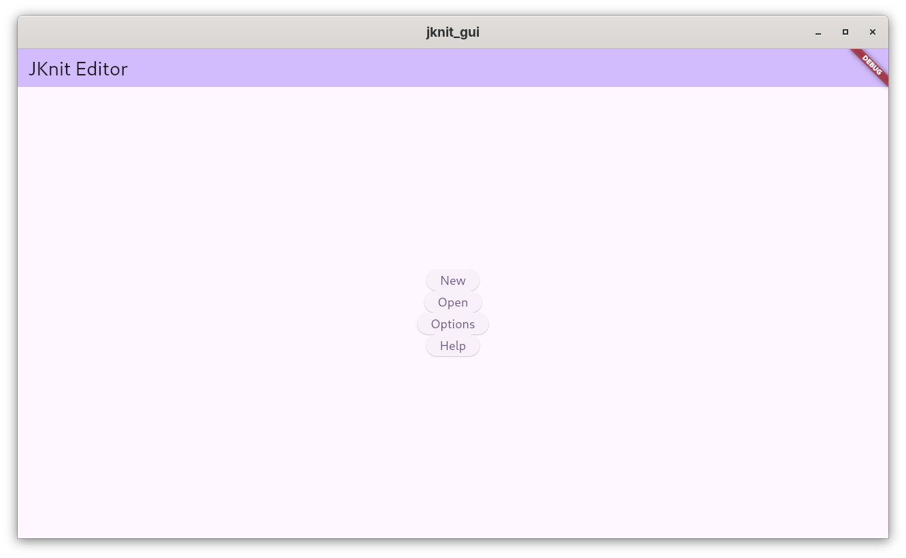

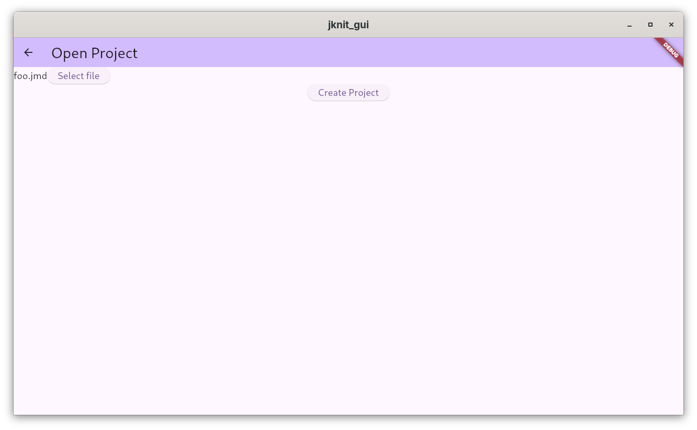

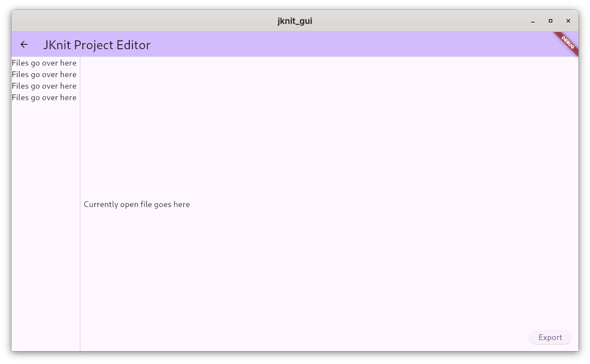

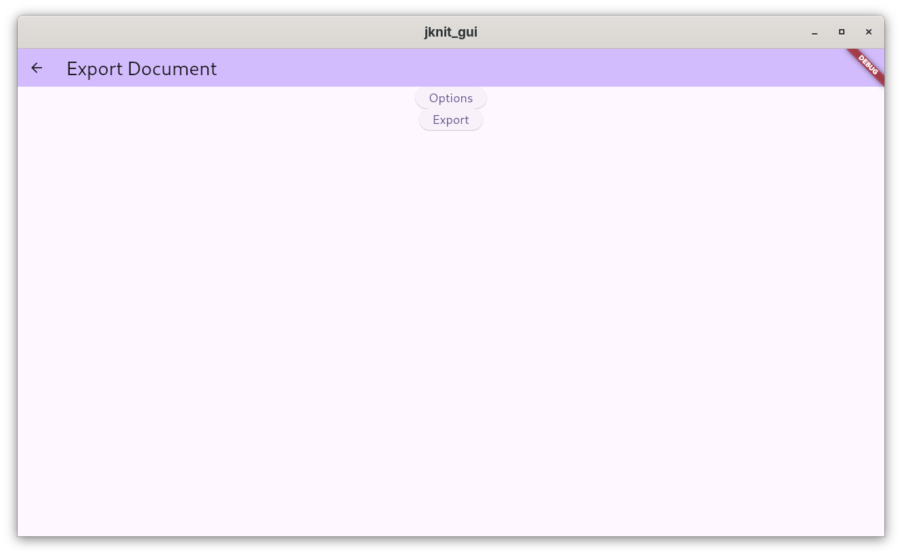

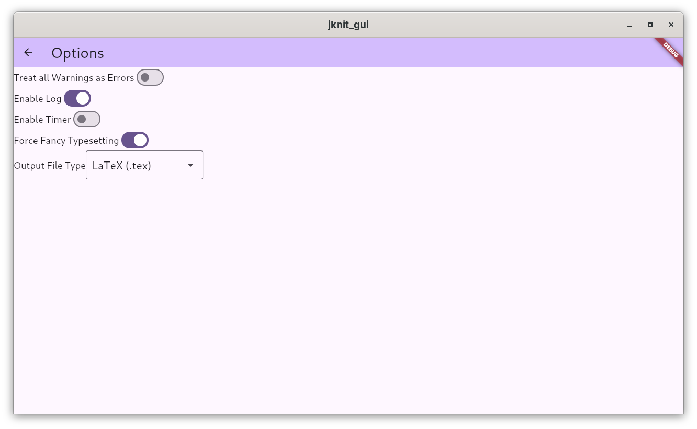

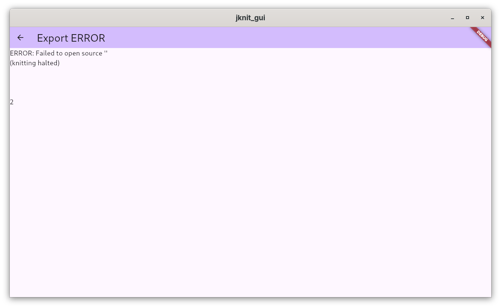

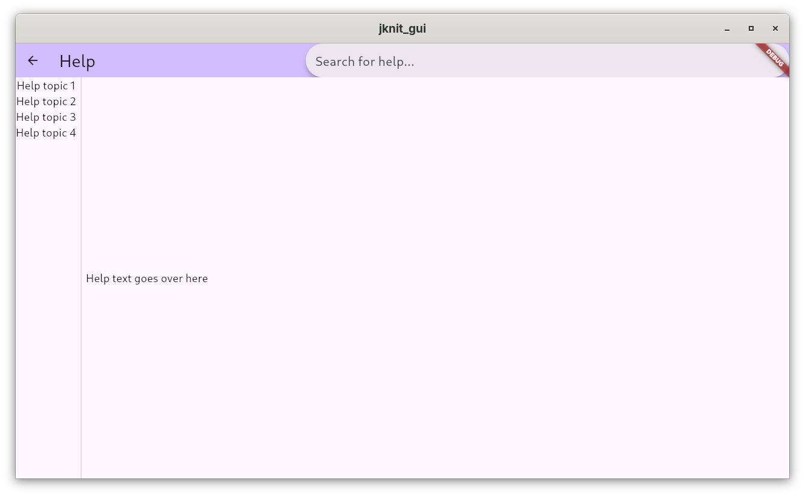

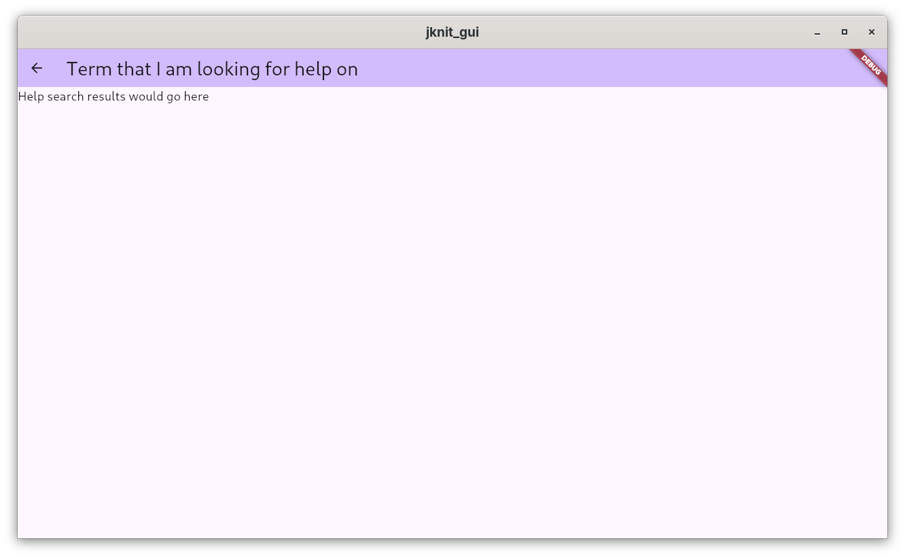

This is a good place to start, and more-or-less reflects the
original paper design.

## Design Choices Make on UI/UX Principles

1. Removed home screen, replaced with most recent file editor
    - Users will not usually need this intro: It would only be
        helpful for first-time users
2. Replaced `New` and `Open` with system dialogues
    - They had previously only contained a button that opened
        the system dialogues, and thus were redundant
    - This choice avoids an additional unnecessary step which
        might have confused or annoyed users
3. Removed initially proposed file bar on left-hand-side of
    editor
    - A `jmd` document is a single file, so I realized that it
        was not necessary to have a vscode-style file selector.
        A single file being open is fine
    - This eliminates wasted space on the screen and removes an
        opportunity for the user to be confused
4. Made the `Export` screen a pop-up dialogue
5. Centered options in the middle of the screen
6. Left-aligned option labels and right-aligned option toggles
7. Made export error/success a pop-up
8. Added system-style file bar at top of editor
9. Added traditional key bindings in editor
10. Added `recents` tray in editor
11. Added `View` option for exported Markdown documents

## Final Product

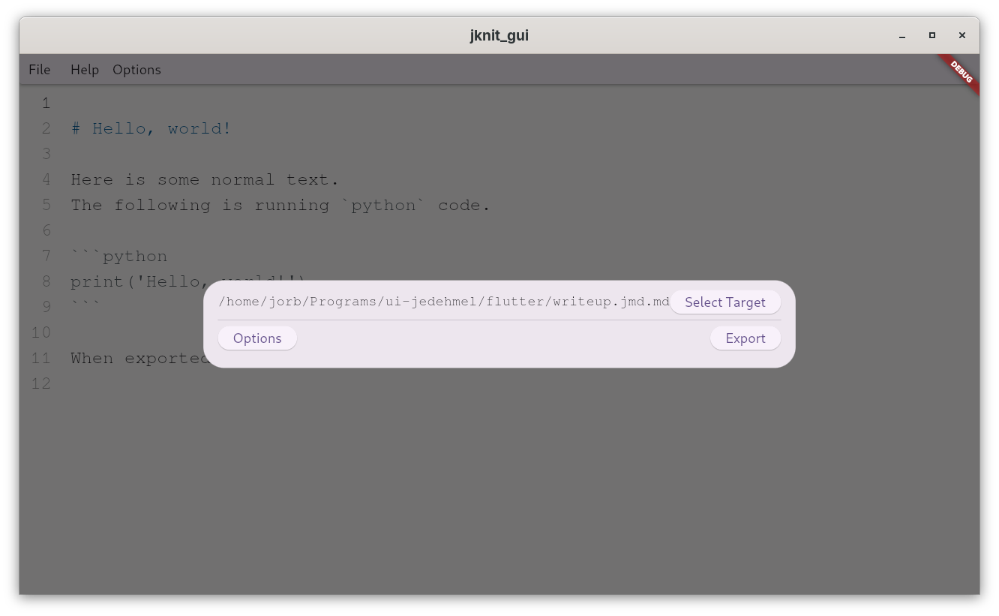

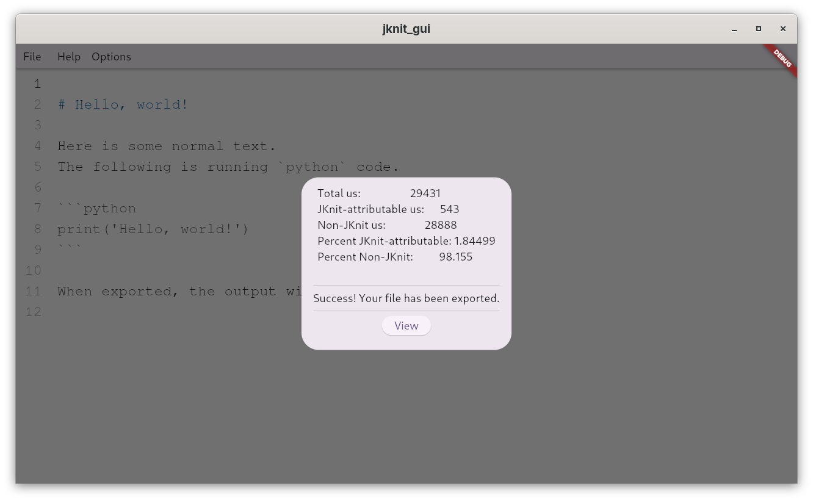

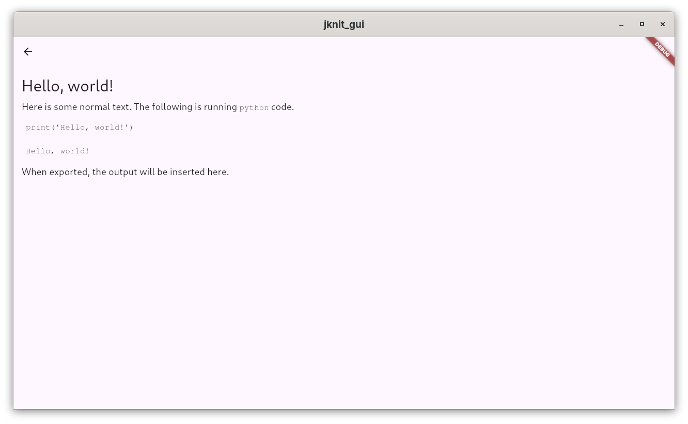

## Final Unit Testing

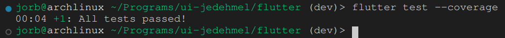

## Conclusion / Reflection

The final GUI successfully interfaces w/ the CLI, avoids bloat
to the extent allowed by Dart/Flutter, is FOSS, and tries to be
intuitive for those who do not have CLI experience. It reflects
the design decisions taken by existing players in the IDE
industry, especially the Visual Studio family of editors. It is
easy to install to the extent that Dart/Flutter allows, although
Windows operation would be notably impaired by that platform's
lack of built-in compilers and interpreters.

The following user stories (including the third test case from
the UX test) are achievable in the final product.

1. "I need to write a report for my math class"
2. "I need to modify and export a JMD file someone sent me"
3. "I need to quickly explain this software to my students"
4. "I am a teacher and I want to demonstrate how to create and
    export a document to `markdown` format in my class"

The first and second boil down to UI design choices: I have
tried to make actions like opening, modifying, and exporting as
easy as possible. These actions also mirror the precedent for
IDEs / text editors, so they shouldn't be difficult for
beginners. The third and fourth are explainability limits, and I
have tried to keep the design explainable and familiar.

The following two user stories from the UX test were obsoleted
after revisions.

1. "I am an intro to applied math student and I want to create a
    new document to edit, then a new file in the current
    document"
2. "I am an intro to applied math student and I want to find out
    what the 'Dockerfile' option means in the export menu, then
    open an existing document named 'hello.jmd'"

The first was obsoleted because I decided allowing the user to
have multiple files in a single document was unnecessarily
confusing (reflected in the failure of this test case during UX
testing). The second was partially obsoleted, since I did not
end up implementing a `Dockerfile` option. However, the
underlying principal of looking up help, as well as the clause
about opening an existing document, remain valid.

There remain several unfulfilled "strech goals": The
aforementioned `Dockerfile` option would add usability and
portability (or at least centralize the software dependencies)
by allowing users to use containerized environments.
Additionally, the unit testing for the project had to be fully
restarted after a major design overhaul and thus is not
fully-fledged: More rigorous unit testing (and perhaps a
coverage report) would allow more confidence in the software.
