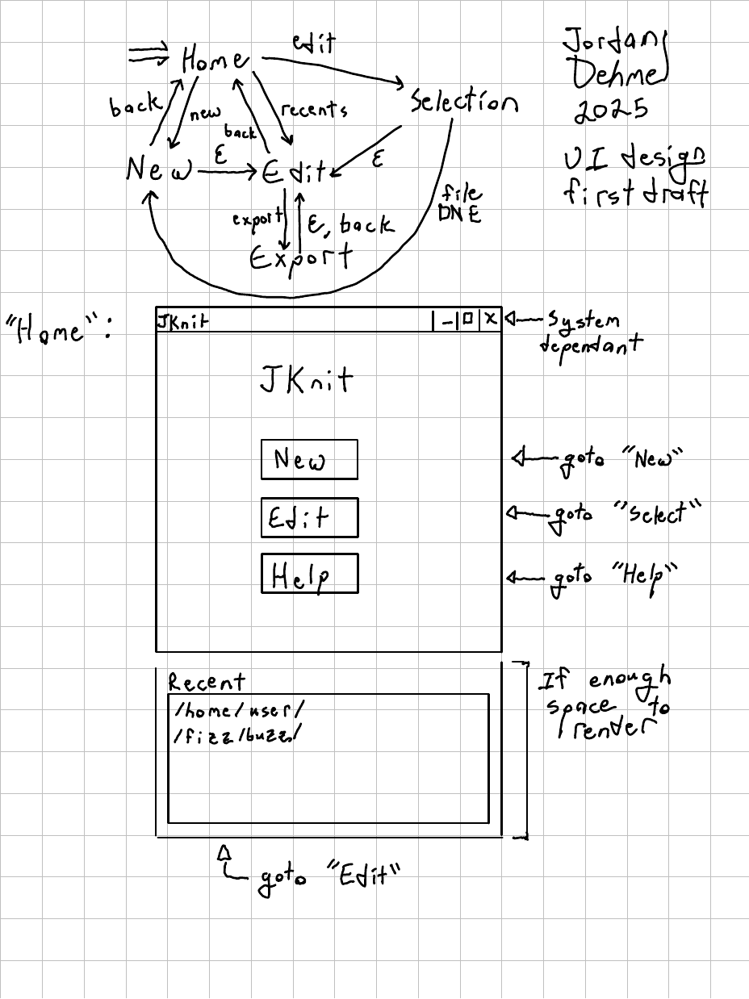
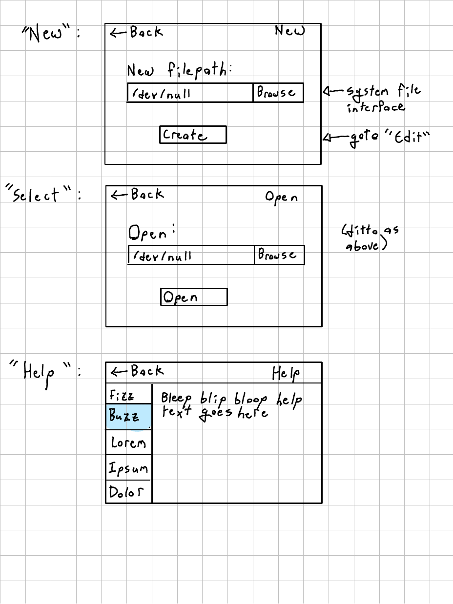
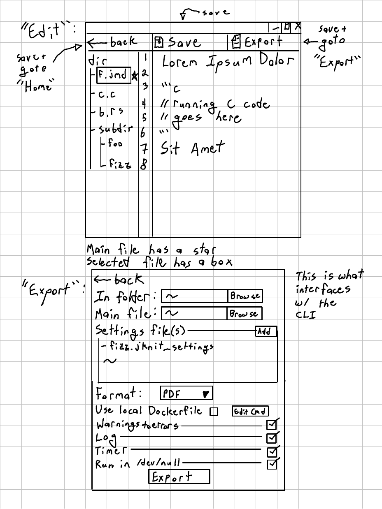
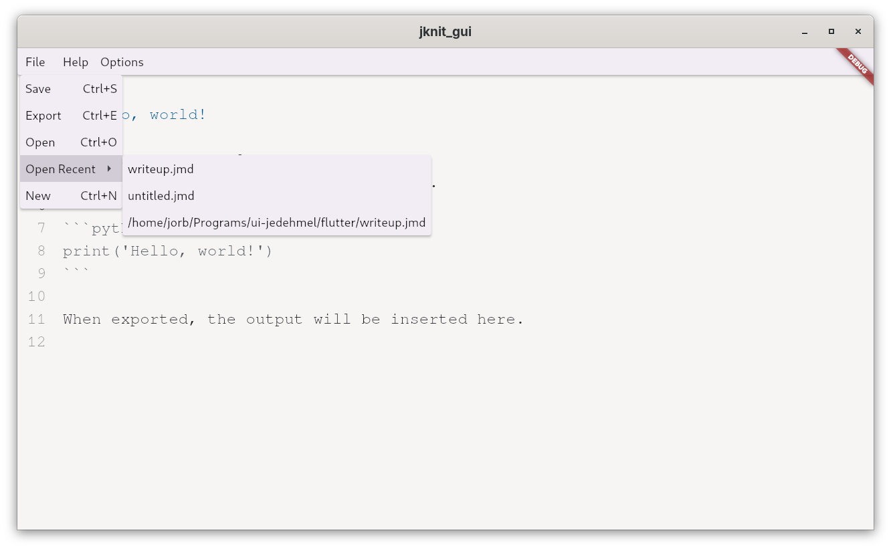
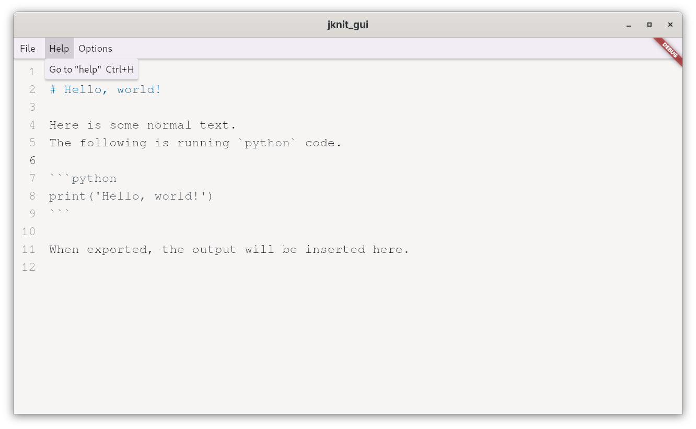
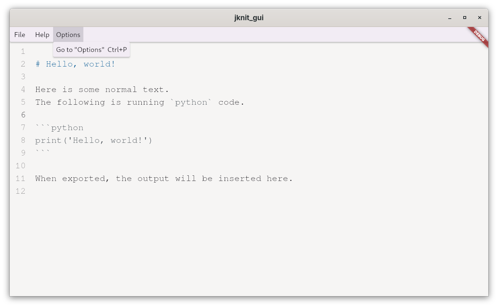
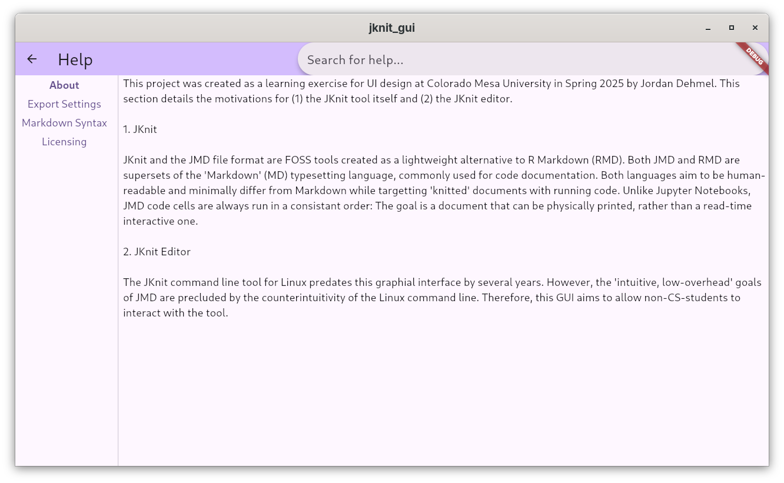
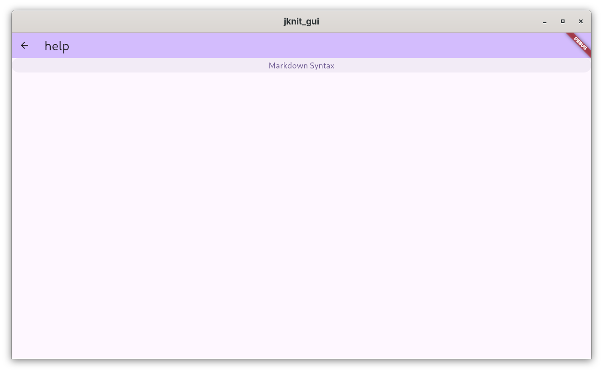
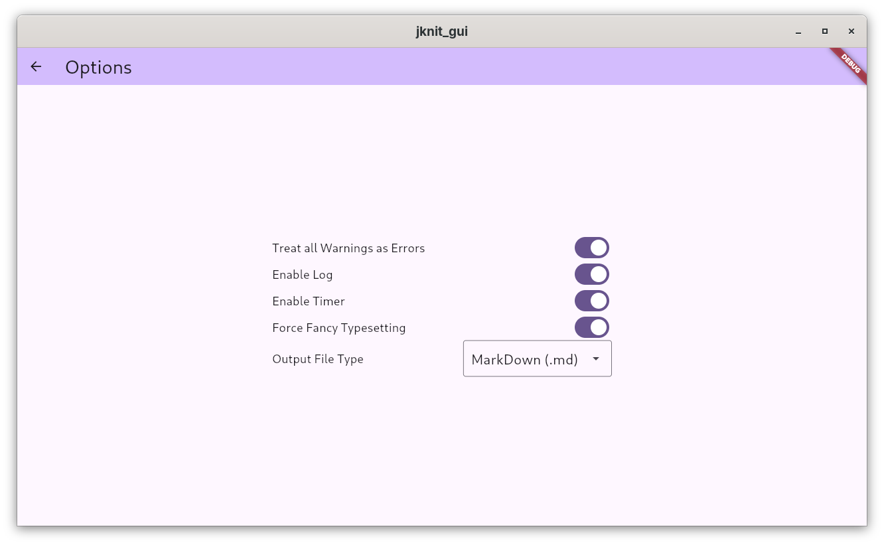

<!-- TODO: purpose, reqs, audience, user stories,
     first iteration, design choices, conclusion -->

# User Interface Design Final Report

Jordan Dehmel, 2025

## Purpose

## Requirements

## Audience

## User Stories

## First Iteration

### Paper UI

### UI Test

**Stakeholder Stories / Test Cases**

1. "I am an intro to applied math student and I want to create a
    new document to edit, then a new file in the current
    document"
2. "I am an intro to applied math student and I want to find out
    what the 'Dockerfile' option means in the export menu, then
    open an existing document named 'hello.jmd'"
3. "I am a teacher and I want to demonstrate how to create and
    export a document to `markdown` format in my class"

**Measuring Success**

1. Test case 1 will be considered a success if they are able to
    create a new document. It will be a partial success if they
    cannot create a new file. It will be a failure if they are
    not able to create a new document.
2. Test case 2 will be considered a success if they are able to
    navigate to the help menu, then to the 'Docker' menu. Then
    they should be able to navigate back to home and open an
    existing document. It will be a failure if they are unable
    to find help or to escape the help menu and open an existing
    document.
3. Test case 3 will be considered a success if they are able to
    create a new document, then successfully reach the `export`
    screen. It will be a partial success if they stop at this
    point, and a full success if they are able to change the
    default document type and export. It will be a failure if
    they are unable to create or export a document.

**Experimental Design**

- Only the vaguest follow-up questions will be asked after the
    fact so as not to retroactively influence their opinions

The following are both experimental design points and things I
will say to the subject before beginning:

- I will ask them about their experience in CS and math,
    especially in writing reports
- I will have my paper design and simulate the computer
- I will instruct them to narrate their thoughts and actions,
    and I will simulate those actions
- I will give them a task that they will try to complete
- For text blocks and dropdowns that I have not detailed in my
    paper model, I will narrate what will be displayed.

**Choosing A Subject**

Test subject criteria:

- College student
- In a math / CS class (preferably applied math)
- **Not** an experienced CS person

---

**Post-Test Reflection**

1. Task 1 was a partial success: She was able to create a new
    document, but there was no clear way to make a new file in
    that document's folder, and she made a second document
    instead.
2. Task 2 was a success with notes. She found it unclear how to
    find help for a specific keyword, and suggested a search
    function. She was able to navigate back to the home menu
    and open an existing document, although she suggested
    different verbiage for the button doing so.
3. Task 3 was a partial success. She was able to create a new
    document and navigate to the export menu, but was unable to
    proceed without further direction. She found this menu
    overly technical.

The overall impression was that the app was overly technical and
lacking in help. A search bar for keyword help and an "advanced
settings" submenu would likely solve these problems. The menu's
"edit" button should also say something more like "open", and
the help menu should be more intuitive.

## Design Choices Make on UI/UX Principles

## Final Product

## Conclusion
